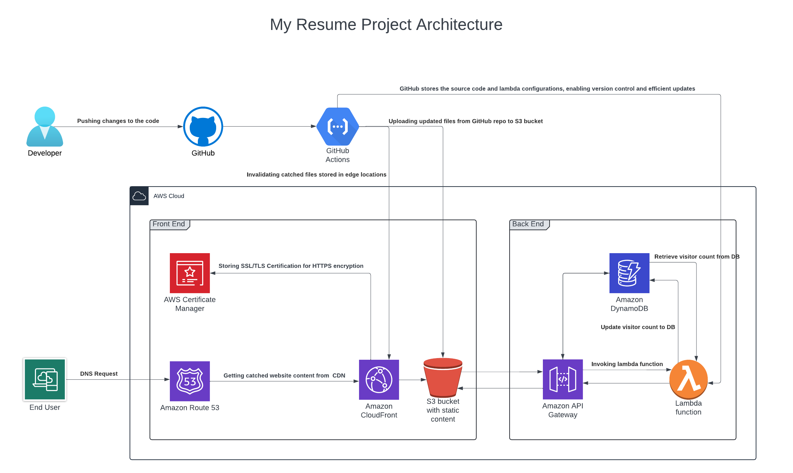

# Walysson Santos - My resume on AWS
## About This Project 
This is my Cloud Resume Challenge built on AWS Cloud. I have built a static website hosted on AWS S3 bucket, wich I have include a visitor counter built on AWS Lambda functions. To build this website I have worked with HTML, CSS, and JavaScript programing languages. The visitor counter is built with Python and AWS lambda functions. 

## Demo

[View it live here](https://resume.naveenraj.net)

## Structure

- `.github/workflows/`: Folder contains CI/CD workflow configurations.
- `frontend/`: Folder contains the website.
    - `index.html`: file contains frontend website code.
    - `js/visitorcount.js`: file contains visitor counter code to retrieve & update the visitors count.
- `infra/`: Folder contains the infrastructure codes.
    - `lambda/lambda_function.py`: Contains the visitor counter code which is deployed on lambda function.
    - `main.tf`: Contains the backend infrastructure written as terraform code.

## AWS Services Used
- Route 53
- Cloudfront
- S3 bucket
- Certificate Manager
- Lambda function
- API Gateway
- Dynamo DB

to be concluded
