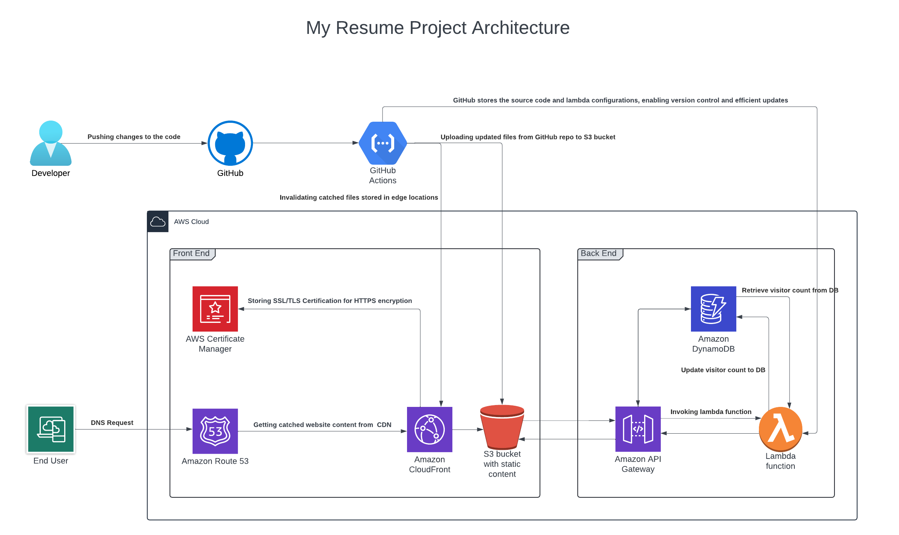

# Walysson Santos - My resume on AWS
## About This Project 
This is my Cloud Resume Project, built entirely on AWS Cloud. The project features a static website hosted in an AWS S3 bucket, developed using HTML, CSS, and JavaScript. I utilized Route 53 to manage the domain name, ACM to secure the site with SSL/TLS certificates, and CloudFront for fast content delivery, with automatic redirection of HTTP traffic to HTTPS for enhanced security.Additionally, I implemented a visitor counter using AWS Lambda functions, written in Python.

Below is my project architecture overview:

## Demo

[View it live here](https://www.walyssonsantos.com)

## Structure

- `.github/workflows/`: Folder contains CI/CD workflow configurations.
- `assets/images/`: stores the architecture diagram of the project (architecture.png), which visualizes the architecture of the website and its cloud components.
- `frontend/`: Folder contains the website.
    - `index.html`: file contains frontend website code.
    - `css`: contains the stylesheets, including styles.css, which defines the website’s layout and design.
    - `js/visitorcount.js`: file contains visitor counter code to retrieve & update the visitors count.
- `resume/`: Folder contains the resume PDF file.
- `infra/`: Folder contains the infrastructure codes.
    - `lambda/lambda.py`: Contains the visitor counter code which is deployed on lambda function.

## AWS Services Used
- Route 53
- Cloudfront
- S3 bucket
- Certificate Manager
- Lambda function
- API Gateway
- Dynamo DB
